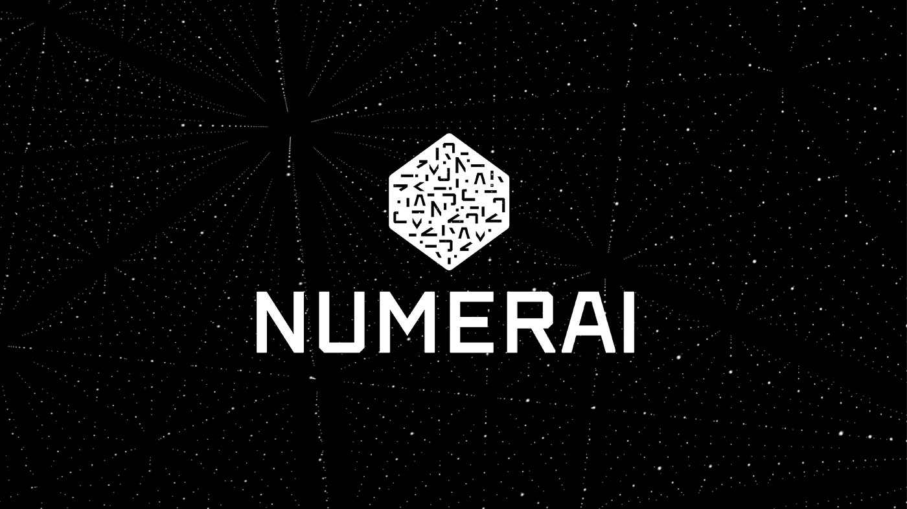

# Numeraire Case Study

---
## Overview and Origin

**Numerai** is a hedge fund-backed blockchain whose goal is to be the "last" hedge fund. Their high-level strategy to acheive this was shared in a blog post by the founder, Richard Craib in 2017. His *master plan*, as he calls it is:

    1. Monopolize intelligence  
    2. Monopolize data
    3. Monopolize money
    4. Decentralize the monopoly

 Phase one, **monopolizing intelligence** by leveraging the minds of data scientists and machine learning experts throughout the world as opposed to other hedge funds that rely on the talents of a very small group of people. They achieve this by holding a weekly tournament where those experts can submit stock market predictions and are rewarded with cryptocurrency for models that provide accurate predictions. Those predictions are then combined into their meta-model which they use to determine their trading strategy
 The idea originated when Craib was working for an asset management fund in South Africa. He wanted to ask a friend who was better with machine learning to help analyze some data but was told by his boss that he could not share it. So, he set out to find a way to encrypt the data so that is could be shared with others but in a way that they could not use it to start there own fund. 

[Building the Meta Model on Numerai](https://youtu.be/dhJnt0N497c)

---
## Business Activities
The problem with a crowdsourced hedge fund strategy is that the data and tools controlled by these funds are highly proprietary and competetive. Hedge funds will not reveal their data, signals, or results for fear that a competitor will use that information to start their own fund. So the need exists for the data to be encrypted; however, encrypting data generally leads to it being altered in a way that keeps it from being analyzed accurately. Craib's major breakthrough was a unique encryption method that allows tournament participants to analyze the encrypted data and submit it without it becoming corrupted. This allows Numerai to leverage the skills and knowledge of a much larger group of data scientists instead of relying on just one or two indviduals for decision making on investments. 

One of the other problems that Numerai needed to solve was the problem of overfitting. Overfitting occurs when a model performs very well with the test data set, but does not match that performance when predicting new outcomes. It is common in these types of competitions as many incentivize the models to match well with test data and not necessarily future data. To solve this issue, they are using a blockchin/cryptographic solution in conjunction with machine learning and crowdsourcing. 

Numerai solves this problem through a couple of different methods. As mentioned earlier, models with real-world predictive value are rewarded with cryptocurrency. In Craib's original model, they rewarded the tournament contributors with Bitcoin. However, he realized that his strategy was flawed. First, it led to some technical inefficiencies. Second, he reasoned that the contributors would be less likely to tell other data scientists about the project because they would be competing for the same limited supply of bitcoin. This was counterproductive to their goal of monopolizing intelligence. So Craib launched his own digital currency, Numeraire (NMR), on the the Ethereum network. 

This allowed Numerai to introduced staking of their NMR tokens. Contributors could stake their NMR tokens to their models if they were confident of their predictive value. Again, if the model was successful, they recieved more NMR. However, if the model failed, their NMR could be burned, creating an economic disencentive for overfitting or spamming submissions in the hopes that a small number might have predictive value. In October of 2021, Craib introduced Numerai Signals which provides feedback to the tournament competitors. It indicates whether an uploaded stock signal is unique and has predictive value or is highly correlated to other signals that have already been found by other scientists. This gives them additional information before they decide how much or how little to stake on a prediction. 

---

## Landscape
There are many trends impacting the hedge fund industry over the last five to ten years. They include and increased focus on ESG (environment, social, governance), larger investments in the healthcare industry, and increased capital inflows. But, the most influential and likely the most long lasting is the rise of machine learning by firms like Numerai.

It is a highly competetive space where Numerai is competing with over 10,000 other funds throughout the world. The largest players in the industry according to [Investopedia](https://www.investopedia.com/investing/biggest-hedge-funds-world/) is Bridgewater Associates, which is run by legendary investor, Ray Dalio, and Renaissance Technologies which is one of the largest [quantitative](https://www.investopedia.com/terms/q/quantitative-trading.asp) trading firms. While many other firms use quantitative analysis, none have combined these multiple layers of technology like Numerai. 

---

## Results
 Crowdsourcing data analysis was not a brand new idea in the world of finance. Other organizations have been working with crowdsourced, quantitative trading models: QuantConnect, World Quant and the recently shuttered Quantopian. However, Craib boasts in a blog post,
> "we have since built the largest stock market data science tournament in the world by providing free data and paying out millions to our community - over $40 million since launch."
 
Unfortunately, information on the performance of the Numerai hedge fund is proprietary and not available publicly. We cannot gain access to Numerai's financial results or compare them to the results of competitors. This lack of transparency in the industry is a point of frustration for Craib and a benefit of crowdsourcing. Craib states in a 2019 [keynote address](https://www.youtube.com/watch?v=YojhLjLrG1M&t=383s) that the best and the brightest in the industy are often reproducing the exact same work with the same results because they have little information on the methods and results of competitors. 

---

## Recommendations
 The concept that Craib is working on is truly impressive and disruptive; however, it is yet another hedge fund among thousands that aim to make millionaires and billionaires richer. One of the things that is most inspiring about the development of blockchain technology, decentralized finance, and cryptocurrency is the massive opportunity to bring a real, market solution to bear on many of the problems surrounding economic inequality. If the end goal for Numerai is to use these technologies to create the most successful and dominant hedge fund that denies access to almost all of the population of Earth, I believe they are not only missing an opportunity to have a positive impact in the world but, from a strategy perspective, are likely to be surpassed by a competitor with a similar model but that offers wider access to the fund or a token that follows the performance of the fund.

Since we do not have financial performance data on Numerai, we cannot find or determine if there is an actual correlation between its performance and the value of the Numeraire token. However, though we don't have specific data, we can safey assume that the performance is not matched. If we simply look at the volatility of the NMR token over the last few years it is much more closely aligned with the emotional and capricious swings of the crypto market as opposed to the comparatively stable changes in the stock market. An article published on btcmanager.com in 2018, confirms that:
> "the value of the Numeraire token has not shown a correlation with the outperforming hedge fund. This means that while this hedge fund project is a success, the value of its token is seemingly not as closely linked to the project and the fund's performance as many holders would like to see."

I would recommend for Numerai that they work on a mechanism that can stabalize the price of the NMR token and tie it to fund performance. This would further incentivize their data scientists and would allow the rest of the world to benefit from this model. I believe that would significantly increase buying pressure which would increase the value of the token and therefore increase the economic incentive for data scientists to create new and better models. This would create a virtuous cycle of growth and reward to participants and token holders. 

Unfortunately, crypto prices are heavily tied to market sentiment and the emotions of the market particpants. So tying the value of NMR to the fund would be challenging. Though a look at stablecoins my reveal some answers. There are algorithmich stablecoins that use algorithms to reduce or increase the supply of the coin to respond to market activity. Other stablecoins are backed by tangible assets such as fiat currency or commodities. If Numerai could tie NMR to the actual performance of the fund, it would comport to ESG trends in the industry and greatly broaden its market. 

## References
https://numer.ai/

https://medium.com/numerai/numerais-super-massive-data-release-d3ca4a7a5feb

https://www.publish0x.com/crypto-truth-lexicon/top-things-you-should-know-about-numerai-nmr-xvrveme

https://medium.com/numerai/building-the-last-hedge-fund-introducing-numerai-signals-12de26dfa69c

https://btcmanager.com/what-is-numeraire-and-is-it-a-good-investment/

https://cryptobased.org/how-stablecoins-stay-stable-explained/

https://medium.com/numerai/a-new-data-science-competition-where-being-different-pays-251c2aecc40a